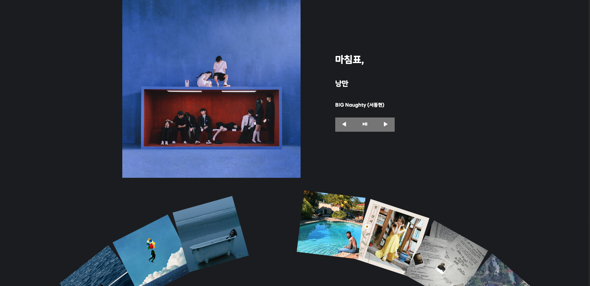
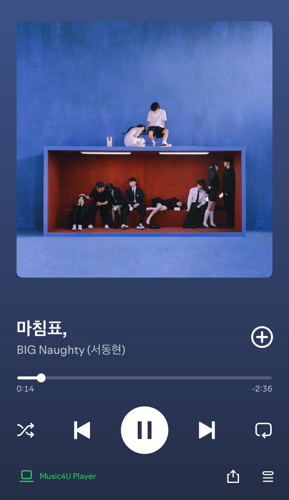

# 데스크셋업에 잘 어울리는 🎧Music4U🎧

## **Music4U**는 Spotify API와 Web Playback SDK를 활용하여 사용자가 음악을 탐색하고 재생할 수 있는 웹 애플리케이션입니다. 직관적인 UI와 부드러운 애니메이션을 통해 음악 감상 경험을 한층 더 향상시킵니다.

_(현재 로그인 페이지는 구현되어 있지 않으며, 추후 업데이트할 예정입니다. Spotify Premium 유저가 직접 토큰을 입력하면 실행 가능합니다.)_

## 🔗 프로젝트 소개

- **[Music4U Notion](https://adorable-panama-924.notion.site/Music4U-1cf8c3bce0358015b877c67139407877?pvs=4)**  
  프로젝트의 상세한 설명과 개발 과정을 Notion 페이지에서 확인할 수 있습니다.

## 📸 프로젝트 스크린샷

  
  

## 📅 제작 기간

- **2025년 4월 3일 (목) ~ 2025년 4월 8일 (화)**  
  총 **6일**

## 📋 주요 기능

### 1. **음악 재생 및 제어**

- Spotify Web Playback SDK를 활용한 음악 스트리밍
- 재생, 일시정지, 이전곡, 다음곡 제어
- 모바일 Spotify 앱과 실시간 동기화 (Spotify Connect)

### 2. **인터랙티브 UI**

- GSAP을 활용한 회전형 캐러셀 구현
- 카드 클릭 시 부드러운 전환 애니메이션
- 드래그 앤 드롭으로 캐러셀 회전 조작 가능

### 3. **음악 정보 표시**

- Spotify API를 통해 실시간으로 음악 데이터 조회
- 트랙 이름, 아티스트, 앨범 정보 표시
- 클릭한 카드의 이미지를 배경으로 설정 및 블러 처리

### 4. **Spotify Connect를 통한 모바일 조작**

- **크로스 디바이스 제어**: 웹에서 재생 중인 음악을 모바일 Spotify 앱에서 실시간으로 제어 가능
- **동기화된 재생 상태**: 모바일과 웹 간 재생, 일시정지, 다음곡/이전곡 상태가 즉시 동기화
- **플레이리스트 연동**: 웹에서 생성한 플레이리스트를 모바일 앱에서 바로 확인 및 재생 가능
- **유연한 디바이스 전환**: Spotify Connect를 통해 다양한 디바이스 간 원활한 전환 지원

## 🛠️ 기술 스택

### **Frontend**

- HTML, CSS, JavaScript

### **라이브러리 및 프레임워크**

- GSAP (GreenSock Animation Platform)
  - Draggable 플러그인: 드래그 앤 드롭 기능
  - Flip 플러그인: 부드러운 전환 효과

### **API 및 SDK**

- Spotify Web Playback SDK: 웹 브라우저에서 Spotify 음악 재생
- Spotify Web API: 음악 정보 조회 및 제어

### **HTTP 클라이언트**

- Axios: API 통신 및 데이터 요청 처리

---
